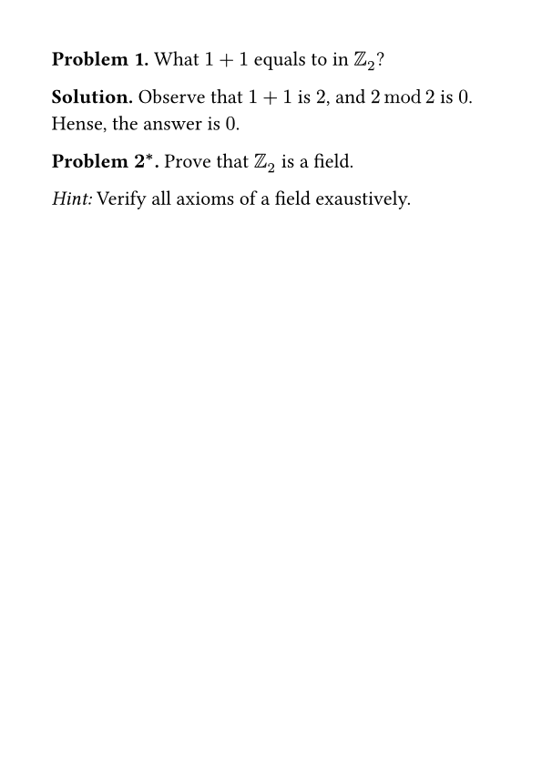
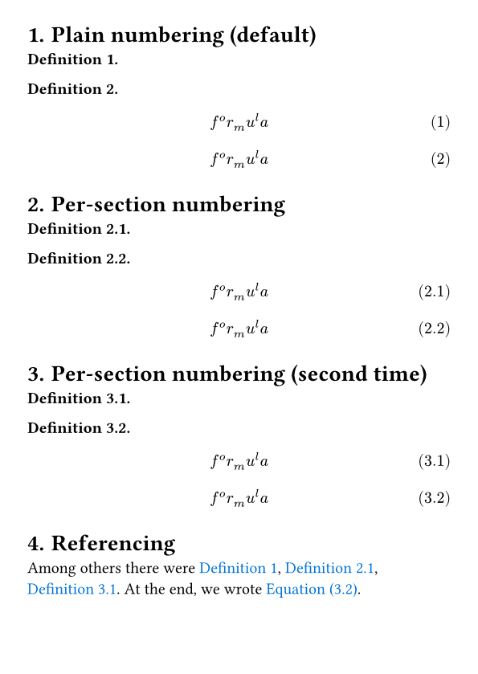
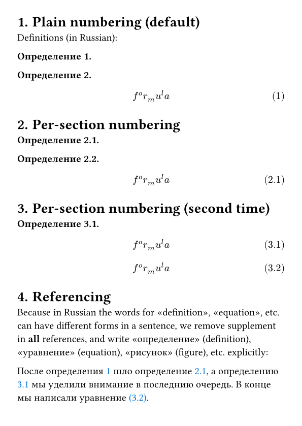

# typst-theorems

An implementation of theorem environments
[typst](https://github.com/typst/typst).

Import as
```typst
#import "@preview/theofigs:0.0.1": *
```

# Features

- Default theorem environments, which as specifications of function `theofig`:
    - `theorem`
    - `lemma`
    - `statement`
    - `proof`
    - `corollary`
    - `remark`
    - `example`
    - `definition`
    - `algorithm`
- Custom theorem environments can be added.
- Environments can share counters by having the same `kind` but different `suppliment`.
- Environments can be `<label>`'d and `@reference`'d
- Environments can be customized with show rules as `figure`s with corresponding kinds.
    - apply text style, block with stroke or fill, etc
    - customize text style of the suppliment
    - customize numbering
- Convinent selectors for environments, which can select all, some, or all except some theorem environments.

# Examples






# Why another one?

There is a number of packages for theorem environments, including [all
theese](https://typst.app/universe/search/?q=theorem). Many of them are
similar to this project, but differ in small details of how style 
customization is handled. Our package offers predefined commands
such as `#definition`, `#theorem`, and `#proof` together with
style customization which can be applied to all or some environments.
We focus on minimalization of necessary boilerplate in preambule,
aiming to provide a package which is setup in 2-3 lines of code in preambule
for most of uses with reasonable ability to customize further when needed. 

